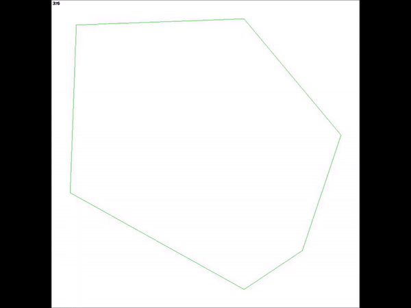

# Here are some visuals
## Simulations 
This is a sample of scenario 4 - Tracked ball and 10 balls in a square 

## Predictions
This prediction is over 90 frames. It was trained over 10 different scenario simulations of 40 seconds each.

Blue line is the real value --- Red line is the time march prediction

